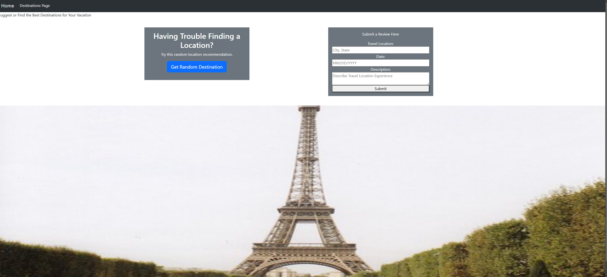

# <Travel-Destinations>

## Description

Provide a short description explaining the what, why, and how of your project. Use the following questions as a guide:

- Our motivation for creating this project is our interest in traveling and sometimes figuring out where to go and what to do at certain travel locations can be a challenge.

- This project was created to provide a tool to help users have an easier time with travel planning.

- This project helps to improve travel planning and to attract more visitors to potential travel destinations that could be hidden gems.

- Through this project we were able to learn more about using GitHub to collaborate on Web Development Projects. We were also able to apply coding skills in the following languages: HTML, Javascript and CSS. Using CSS frameworks was also something new that was learned through this project and modification to a CSS framework to present it to our vision.

## Table of Contents

- [Description](#description)
- [Usage](#usage)
- [Credits](#credits)
- [License](#license)

## Usage

    

## Credits

Collaborators:
- Alex Vue, https://github.com/AVue00
- Zach Owen, https://github.com/Rilsotea
- Jordan Meade, https://github.com/jomeade123

- Bootstrap was used to help develop some of the styling. Below is a link directing to Bootstrap and the page listing of framework.
- https://getbootstrap.com/docs/5.3/getting-started/introduction/

## Features

Link to Webpage below:
https://jomeade123.github.io/Project1/index.html
